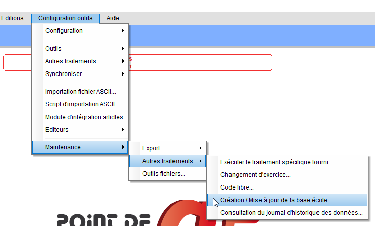
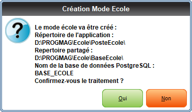

:linkattrs:
:toc:
:toclevels: 5
:lang: fr
:doctype: book
:sectnums:
:chapter-label:
:toc-title: Table des matières
:imagesdir: src/docs/asciidoc
:pdf-themesdir: ./src/docs/asciidoc
:pdf-theme: pdv
:icons: imagee
:icontype: png
:iconsdir: /etc/asciidoc/images/icons

// ----------------------------------------------------------------------
// Copyright (c) 2013-2022 kopiLeft Services SARL, Tunisie
// Copyright (c) 2018-2022 ProGmag SAS, France
// ----------------------------------------------------------------------
// All rights reserved - tous droits réservés.
// ----------------------------------------------------------------------

= Création base ecole
Manuel utilisateur
481-A

== Avant propos

La base école est disponible en version 3 de Point de Vente, à partir de la version 3.3.3.

Elle peut être installée sur un poste qui n’est pas le poste serveur.

Dans ce cas, il faudra installer un serveur de base de données PostgreSQL en version 10.

== Création et mise a jour de la base école

Pour lancer la création ou la mise à jour de la base école, cliquez sur Configuration outils / Maintenance / Autres traitements / Création / Mise à jour de la base école :

Le message suivant pour permet de savoir où seront sauvegardés les répertoires de travail :

Une fois le traitement terminé, le raccourci pour lancer la base école est disponible sur le bureau Windows.

== Historique

[cols="^2,^5,10,29", options="header"]
|==========================================================================================================
|Rev |Date       ^|Auteur          ^|Modifications
|A   |24.11.2022  |Pierre ADROT     |Transcription en Asciidoc
|1   |07.06.2019  |AL               |Création
|==========================================================================================================

